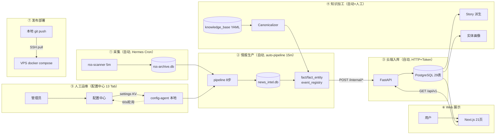
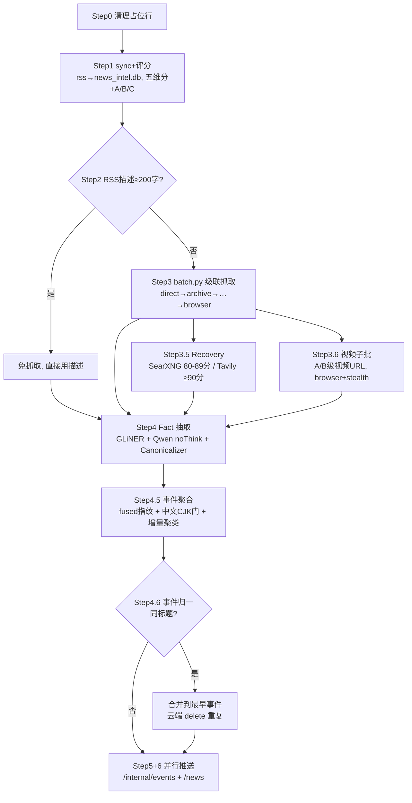
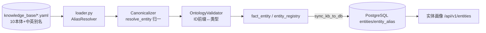
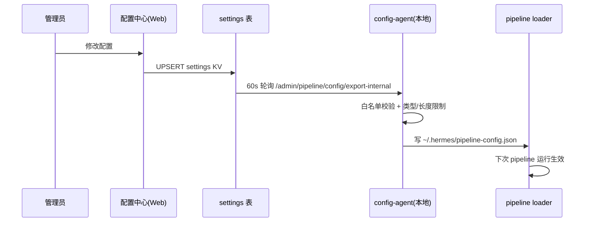

# 业务流程 — News Intelligence Platform 全链路

> 最后更新: 2026-08-07
> 视角: 业务过程（触发 → 步骤 → 决策 → 产出 → 消费），非字段映射（字段见 [data-flow-fields.md](data-flow-fields.md)）。
> 覆盖: 自动采集生产、事件/事实/故事/实体加工、人工校对、配置下发、Web 展示、发布部署 六大业务过程。

---

## 一、业务全景图



---

## 二、业务过程详解

### 过程 1 — 采集（rss-scanner）

| 项 | 值 |
|:---|:---|
| 触发 | Hermes Cron 每 5 分钟 |
| 输入 | 98 个 RSS 源（10 类: 通讯社/国家媒体/金融/科技/地缘/政府/科研/实时/X-Nitter/中文央媒） |
| 执行 | `rss-scanner.py` → feedparser + httpx 连接池（14 并发） |
| 网络 | 境外源走 SOCKS5 :10808，国内/中文源直连 |
| 产出 | `~/.hermes/rss-archive.db`（rss_articles，SHA256 指纹去重） |
| 失败处理 | 连续 3 次失败 → 隔离 1800s；每源 last_seen 增量游标 |
| 附带 | 每日 RSS 日报写入 `~/wiki/RSS-Digest/{日期}.md` |

### 过程 2 — 情报生产（auto-pipeline）

| 项 | 值 |
|:---|:---|
| 触发 | Hermes Cron 每 15 分钟（进程锁防并发） |
| 入口 | `auto-pipeline-wrapper.py` → 生产版 `auto-pipeline.py`（profile 目录） |
| 决策链 | 评分 → Tier 分流 → 抓取成本控制 → 事实/聚合 → 推送 |



**决策点**（详见 [pipeline-l0-l7-rules.md](pipeline-l0-l7-rules.md)）:
- **Tier 分流**: score ≥90 → DeepSeek；60-89 → Qwen3 本地；<60 → Python 规则
- **抓取成本**: 级联策略成本递增，成功即停；视频 URL 走专用预算链路
- **聚合合并**: EVENT_THRESHOLD=60 / MERGE_THRESHOLD=75 / 跨语言=50
- **归一**: 同标题事件合并保留最早 event_id

**产出**: 本地 event_registry（Dossier）+ fact payload → HTTP 推 VPS。

### 过程 3 — 云端入库（internal API）

| 端点 | 内容 | 幂等策略 |
|:---|:---|:---|
| `POST /internal/news/batch` | 文章（分块 100/批） | `ON CONFLICT (url) DO UPDATE` |
| `POST /internal/events/batch` | 事件 Dossier（分块 20/批） | `ON CONFLICT (event_id) DO UPDATE` |
| `POST /internal/facts/batch` | fact + fact_entity | ON CONFLICT + 实体替换 |
| `POST /internal/events/delete` | 归一后的重复事件 | 先清引用表再删主行 |
| `POST /internal/fetch_stats` | 抓取策略统计 | 追加 |

**可靠性**: 失败重试 2 次（3s/6s 退避）；超时细分 `connect=20/read=90/write=20`；Token 校验 `X-Internal-Token`。

### 过程 4 — 知识加工（实体 / 事实 / 故事）

**实体知识流**（KB → 归一 → 入库 → 画像）:



**故事演化流**（事件按 4 维度聚合 → 故事，**手动**）:

```
管理员在配置中心"故事管理"Tab 点击"重建 Story"按钮 (POST /api/v1/stories/derive?dimension=all, 幂等)
  → 按 4 维度分别分组事件（各 ≥2 事件成故事）:
      Subject  → events.subject_name    (主体: 特朗普/苹果...)
      Action   → events.action_type     (动作: ATTACKS/SANCTIONS...)
      Object   → events.object_name     (客体: 伊朗/英伟达...)
      Location → events.location_country (地点: 美国/中国...)
  → 重建 story(story_id 前缀 STORY_/ACT_/OBJ_/LOC_ + dimension 列) + story_event
  → 前端 /stories 菜单切换四维展示
```

> Story = 展示层打包（非因果断言）；event_relations = 保守 precedes（时间序）。
> **手动按钮方案**（2026-08-07 选定）：故事为低频/幂等/可见的展示层操作，采用配置中心按钮按需重建，不做 cron 自动化；页面展示 `derived_at` 上次派生时间以缓解陈旧性。derive 端点带并发锁(409) + 审计日志 + `by_dimension` 分维统计。

### 过程 5 — 人工运维（配置中心）

管理员在 `/config`（13 Tab）或 `/admin`（4 页）执行:

| 运维场景 | 入口 | 操作 |
|:---|:---|:---|
| **事件校对** | 配置中心"事件校对"Tab | 3 面板: 事件列表 → 文章勾选 → 批量 add/remove/exclude |
| **实体管理** | "实体管理"Tab | 编辑 KB JSON → 校验 → 保存热生效 → Git 同步 |
| **实体关系** | "实体关系"Tab | 增删实体关系 / 事件关系 / regenerate 重建 |
| **故事管理** | "故事管理"Tab (14th) | 查看故事数 + 上次派生时间 + 点击"重建 Story"（幂等 + 并发锁） |
| **RSS 源管理** | "源列表"Tab / /admin/sources | 增删改源、启停 |
| **域名策略** | "域名"Tab | 每域名策略链 + known_failing |
| **Pipeline 参数** | "RSS参数/Pipeline/AI/评分/聚合/抓取"Tab | 类型化编辑 → 保存实时下发 |
| **状态监控** | "状态"Tab / /admin/status | KPI + 事件/文章分布 + 最近活动 |

### 过程 6 — 配置下发（配置中心 → 本地）



### 过程 7 — Web 展示消费

| 用户角色 | 能力 |
|:---|:---|
| 匿名 (free) | 公开字段（摘要/评分/事件 Dossier） |
| VIP | 文章全文 content_md + AI 分析 |
| Admin | 全部 + 配置中心 + 校对 + 实体管理 |

前端消费映射: `/api/v1/dashboard`（态势中心）· `/events`（事件）· `/stories`（故事）· `/entities`（实体画像）· `/articles`（新闻）· `/map`（地理）· `/search`（检索）· `/sources`（来源）。

### 过程 8 — 发布部署

```
本地: 更新 Wiki → 改代码 → git commit+push (search-engine-v2)
VPS:  git pull → cd scripts/news-platform-v8 → docker compose up -d --build
验证: curl http://100.107.117.23/api/v1/dashboard
```

> compose 必须在 `scripts/news-platform-v8/` 子目录运行；前端构建在 VPS 完成。详见 [dev-deploy-workflow 记忆] 与 [cloud-deploy.md](../02-deployment/cloud-deploy.md)。

---

## 三、过程 → 角色 → 频率 汇总

| 业务过程 | 触发 | 频率 | 人工参与 |
|:---|:---|:---|:---:|
| 采集 | Hermes Cron | 5m | ❌ |
| 情报生产 | Hermes Cron | 15m | ❌ |
| 云端入库 | 生产触发 | 每轮 | ❌ |
| 知识加工 | 自动 + derive | 增量/按需 | ⚠️ Story 需 admin 触发 |
| 人工运维 | 管理员 | 按需 | ✅ |
| 配置下发 | 保存即推 | 60s 轮询 | ✅ 改配置时 |
| Web 展示 | 用户访问 | 实时 | ❌ |
| 发布部署 | 开发提交 | 按需 | ✅ 开发 |

---

## 四、关键状态与下游依赖

| 业务对象 | 生命周期 |
|:---|:---|
| 文章 | RSS → 评分 → 抓取 → 增强 → 云 articles（stage: published） |
| 事实 | article → GLiNER/Qwen → Canonicalizer → fact/fact_entity |
| 事件 | 文章聚类 → Dossier → 归一（breaking→developing→active→stable→closed） |
| 故事 | 同 subject 事件打包 → 时间线（重建幂等） |
| 实体 | KB YAML → 归一 ID → 实体/别名表 → 画像 |
| 配置 | Web 保存 → settings 表 → config-agent → 本地 JSON → loader 生效 |
