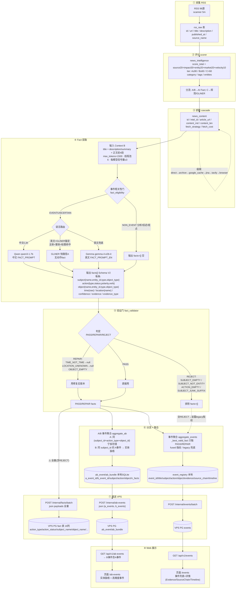

# 全流水线问题评估报告(2026-08-10)

> 视角: **整体流水线 RSS(98源)→评分→抓取→Fact→事件聚合→推送→VPS→Web**。
> 目标: 逐环节列出当前问题 + 遗留任务, 说明"如何产生/具体影响", 给出不同方案并评估。
> 关联: 审查报告 `fact-extraction-p1-review.md` · 交接 `session-handoff-2026-08-10.md` · 契约 `references/fact-schema-v2.md`

---

## 零、流水线全景

```
RSS(98源) ──评分──→ 抓取(cascade) ──Fact提取──→ 事件聚合 ──推送──→ PostgreSQL(VPS) ──→ Web
   │                │              │(Qwen/Gemma)  │(A/B两级)    │(internal/*)    │(Next.js)
   └─死链/中文稀缺     └─抓取失败       └─精度天花板     └─巨型误并/       └─重复堆积        └─展示
```

---

## 一、逐环节问题 + 方案评估

### 环节1: RSS 采集(上游)

| 项 | 内容 |
|---|---|
| **问题** | ① ~61 源死链(404/403, ISS-20260808-003); ② 中文源稀缺(近 5000 篇仅 5 篇中文) |
| **如何产生** | 源 URL 失效/Nitter 封禁; 中文源占比低 |
| **影响** | 中文信息覆盖不足 → 事件/实体图谱偏英文; 死链浪费抓取预算 |
| **方案** | A. 死链批量禁用(配置中心) — 省预算; B. 增补中文源(新华社/联合早报等) — 提升中文覆盖 |
| **评估** | B 影响大(补中文信息短板), A 成本低; 建议 A 立做, B 按需 |

### 环节2: 评分(scorer)

| 项        | 内容                                                                     |
| -------- | ---------------------------------------------------------------------- |
| **问题**   | 评分偏保守(A=0/B=4.6%), 英文关键词子串误标(election⊂Selection, ISS-20260808-005/006) |
| **如何产生** | impact 不累加 + 词边界只点状修补                                                  |
| **影响**   | 大量文章落 C 级 → 无 AI Fact 增强 → 有效 Fact 少 → 事件覆盖低                           |
| **方案**   | A. 降 B 级门槛/impact 累加; B. 词边界系统性修复(子串碰撞扫描)                              |
| **评估**   | A 提升覆盖(注意噪音), B 提升精度; 建议 B 先(A 需验证噪音)                                  |

### 环节3: 抓取(cascade)

| 项 | 内容 |
|---|---|
| **问题** | 部分站点级联全失败 → 无正文, Fact 只能靠标题/摘要 |
| **影响** | 这些文章 Fact 信息少, 事件聚合精度受限 |
| **方案** | A. 增补 archive/jina 兜底; B. 对 Fact 关键文章强制重试 |
| **评估** | 影响中等; 建议按需, 不优先 |

### 环节4: Fact 提取(核心瓶颈)

**问题4.1: Qwen-1.7B 精度天花板**
| 项 | 内容 |
|---|---|
| 现状 | 70篇验收: 总体 S60/A50/O52/T48/L47(英文 S71/A47/O51) |
| 如何产生 | 2B 模型能力 + 语言路由(已用 Qwen中文/Gemma英文 + Context B + 词表扩充) |
| 影响 | Fact 是事件聚合输入 → 精度受限直接传导到事件/影响/预判质量 |
| **方案A: 保持现状** | 成本低, 已验证稳定; 精度 ~50-60% |
| **方案B: 换云模型**(DeepSeek/gpt) | 精度可↑到 80+%, 但成本/延迟/网络/API依赖/中英重新验证; 2B本地实测 0.88× 无并行(换云需重测) |
| **方案C: P1 各项叠加**(Action语义/Time-Loc归一/Grounding/Confidence) | 精度适度↑(预计 +5-15pp), 无新依赖, 增量成本低 |
| **评估** | **推荐 C(性价比最高)**: 先叠加规则归一; 若需 90/85 再评估 B(仅精度关键处用云, 混合路由) |

**问题4.2: 中文人名类型标签错误**
| 项 | 内容 |
|---|---|
| 现状 | 高市早苗→CTRY_TAKAICHI_SANAE(type=Country, 应 Person) |
| 如何产生 | KB miss 后类型猜测用词表, 未覆盖中文人名 |
| 影响 | 实体类型错 → 画像/图谱分类错误; id 虽一致可匹配但展示错 |
| 方案 | 类型猜测改进(CJK 人名启发式: 姓氏库/称谓) — 小改 |
| 评估 | 低成本高收益(中文实体准确性), 建议做 |

**问题4.3: 垃圾主体/短语实体化**
| 项 | 内容 |
|---|---|
| 现状 | A 事件出现 "Negotiation with Iran"/"Observation of Iran" 短语主体 |
| 如何产生 | LLM 提取把整句/短语当 subject, 未过质量门 |
| 影响 | A 事件噪声 → 实体脉络混入垃圾 |
| 方案 | A. LLM prompt 强化"主体必须是实体"; B. 主体短语质量门(复用 _is_value_phrase) |
| 评估 | 建议 B(规则, 低成本); 可并入 validator |

### 环节5: 事件聚合(核心)

**问题5.1: 原 aggregate_events 巨型误并(传递式并入)**
| 项 | 内容 |
|---|---|
| 现状 | EVT-101 把 15 篇无关(Nagasaki/Hezbollah/伊朗/中国)并一起; 事件页质量差 |
| 如何产生 | article→event 只比对**种子指纹**, 传递链 A↔B↔C 让不相干文章依次并入; 通用信号(国家object+粗topic)凑分 |
| 影响 | 事件精度低 → 用户看到"大杂烩事件"; 影响后续影响/预判 |
| **方案A: 质心比对**(P3) | 新文章与**运行中质心**(成员多数SAO)比对, 阻断传递链 — 精度↑, 改动聚合核心 |
| **方案B: 新 A/B 两级聚合**(已落地) | A高精度宁拆勿错/B宽松实体脉络; 已生产接入并 Web 验证 |
| **评估** | **推荐 B(已落地)为主, A 作 P3 整合**: 用 A/B 替代或增强原聚合, 待验证 |

**问题5.2: 增量聚合当轮不出事件**
| 项 | 内容 |
|---|---|
| 现状 | 近期未分配文章 fused 不聚类(0 事件/轮常见) |
| 如何产生 | 最近文章池信号稀疏(facts 覆盖低, 主体空), 阈值/指纹不聚 |
| 影响 | 站点事件增长慢, 用户看"新事件少" |
| 方案 | A. reaggregate_recent 手动放宽窗口(已建); B. 降阈值(有噪音风险); C. 用 A/B 聚合(facts 驱动, 更准) |
| 评估 | A 应急, C 治本(已落地, 待观察) |

**问题5.3: 增量聚合 event_id 非幂等 → 云端重复堆积**
| 项 | 内容 |
|---|---|
| 现状 | 事件列表有读层去重(按 title 分组), 但 DB 事件堆积重复行 |
| 如何产生 | 每轮重聚同一故事生成新 event_id(无幂等键) |
| 影响 | DB 膨胀, 关系/故事/校对关联旧 id 可能孤儿 |
| 方案 | A. 聚合侧按 (title 指纹/subject+action) upsert 幂等; B. 定期归一合并(已有 event_normalizer) |
| 评估 | 建议 A(治本, 中等工作量) |

### 环节6: 推送(pusher)

| 项 | 内容 |
|---|---|
| **问题** | facts/batch location 字段回退 dict → psycopg2 报错 19/22 fact 丢失(已修 `48b42b7`, 现 fail=0) |
| **影响** | 已解决; 教训: 新 Schema dict 字段与后端 VARCHAR 不兼容 |
| **方案** | 已修; 后续加字段类型校验(测试覆盖) |
| **评估** | 已完成 |

### 环节7: Web 展示

| 项 | 内容 |
|---|---|
| **问题** | 历史: 事件 evidence url 缺失(已修 ISS-20260809-010); A/B 事件页已建 |
| **影响** | 已基本解决; 待观察 A/B 页真实数据展示质量 |
| **方案** | 若 A/B 页噪声多 → 前端过滤垃圾主体 |
| **评估** | 观察 |

---

## 二、优先级建议(全流水线视角)

| 优先级 | 事项 | 环节 | 影响面 |
|---|---|---|---|
| 🔴 **P2 Market Impact**(下一大块) | 基于高质量 Fact 产出 Impact | 展示/分析 | 业务价值最大 |
| 🟠 **A/B 整合原聚合**(P3, 方案A) | 质心比对替代巨型误并 | 聚合 | 事件精度 |
| 🟠 **fact 幂等落库**(方案A) | 聚合侧 upsert | 推送/DB | 数据健康 |
| 🟠 **精度叠加**(方案C) | Action语义/Time-Loc归一/Grounding | 提取 | 全链路输入质量 |
| 🟡 **中文人名类型/垃圾主体过滤** | 小修 | 提取 | 中文/事件噪声 |
| 🟡 **中文源增补**(方案B) | RSS 源 | 采集 | 中文覆盖 |
| 🟡 **评分词边界修复**(方案B) | scorer | 评分 | 分级准确性 |

---

## 三、决策点(请拍板)

1. **精度路径**: 方案C(叠加规则)先做, 还是直接评估方案B(云模型)?"宁拆勿错"下哪个性价比高?
2. **聚合整合**: 新 A/B 是否替代原 aggregate_events(P3)? 还是并行观察?
3. **P2 Market Impact** 是否现在启动(路线图下一大块)?
4. **中文覆盖**: 是否增补中文源(影响大但需验证)?

---

## 四、全流水线流程图(带数据明细)

### 4.1 流程图(每环节标注数据)



### 4.2 各环节数据明细

| 环节 | 输入数据 | 处理 | 输出数据 |
|---|---|---|---|
| ①采集 | RSS XML | scanner 5m | `rss_raw`: url/title/description/published_at/source_name |
| ②评分 | rss_raw | 五维评分(A≥90/B≥60/C<60) | `news_intelligence`: score_total/tier/category/tags/entities |
| ③抓取 | 待抓 URL | cascade 9策略 | `news_content`: article_url/content_md/fetch_strategy/fetch_cost |
| ④提取 | title+summary+body | 事件门+语言路由+Context B | `facts[]`: subject/action/object/time/location/confidence/evidence/evidence_type |
| ⑤验证门 | facts[] | PASS/REPAIR/REJECT | `{verdict, repaired, reasons}` |
| ⑥分流 | PASS/REPAIR facts | A/B聚合 / fused聚合 | `ab_event/ab_bundle` + `event_registry` |
| ⑦推送 | 各库 | /internal/* 3 端点 | VPS PG: fact(16列)/ab_event/ab_bundle/events |
| ⑧Web | VPS PG | /api/v1/* | 页面: /ab-events /events |

### 4.3 关键分流点

| 分流 | 依据 | 去向 |
|---|---|---|
| S1 事件相关性门 | 分析/综述/观点/解读(中英) | → facts=[] |
| S2 语言路由 | 中文→Qwen / 英文→Gemma / 英文+GLiNER锚定→快路径A | 3 条抽取路径 |
| S3 验证门 | PASS / REPAIR / REJECT | → 使用 / 修复后 / 排除 |
| S4 下游 | PASS+REPAIR → A/B+聚合(fused); REJECT全拒 → legacy 回退; **⚠️ 推送例外: 全量(含REJECT)进VPS fact 表** | 见上 |
| S5 A/B 两级 | A: 同(subject+action+object)宁拆勿错; B: 同实体A事件 | A/B 事件 |

### 4.4 数据流汇总
```
本地SQLite: news_content → news_intelligence(facts_json) → fact_pipeline_payload.json
          → event_registry → ab_event/ab_bundle
推送VPS:   /internal/facts/batch(全量⚠️) + /internal/ab-events(PASS/REPAIR) + /internal/events/batch
VPS PG:    articles / fact(16列) / ab_event / ab_bundle / events
Web API:   /api/v1/facts? / ab-events / events → Next.js
```

### 4.5 数据缺口(已在图标注)

| 缺口 | 说明 | 影响 |
|---|---|---|
| ⚠️ facts/batch 推送全量 | 含 REJECT 垃圾事实(未过验证门) | VPS fact 表污染, 与聚合/A/B 用的事实不一致 |
| fact 表 16 列 | 含新列 subject_name/object_name/action_status/action_polarity/evidence | 已 ALTER, 正常 |
| A/B 只用 PASS/REPAIR | 干净, 与 fact 表全量不一致 | 建议推送前过验证门(方案A) |
